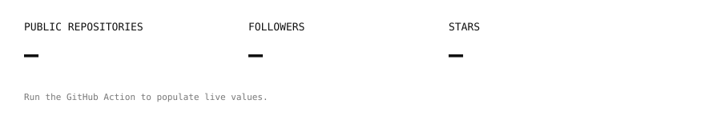
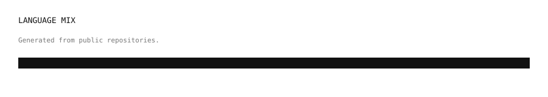
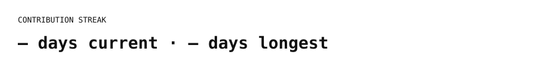
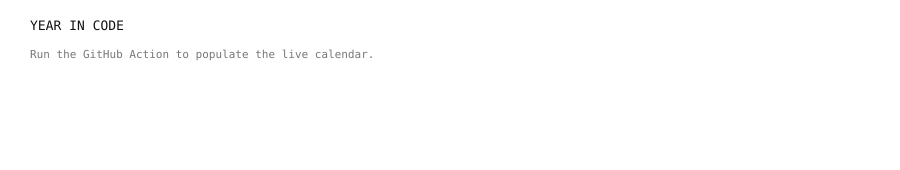

# THARUN DP

`AI / FULL-STACK / BUILDER`

[github](https://github.com/tharun2509) · [SevenPrompts](https://sevenprompts.ai.studio/)

> A small, sharp profile built around the same idea I like in good software: **less noise, more signal**.
>
> The visual assets are generated and stored in this repository. GitHub Actions refresh the live statistics from the GitHub API on a schedule.

I'm **Tharun**, a developer focused on **AI, full-stack development, automation and product building**.

I like turning rough ideas into working prototypes, then improving them into products people can actually use.

Right now I'm especially interested in **Generative AI, LLM applications, AI agents, automation and rapid product development**.

`python` · `typescript` · `javascript` · `react` · `node` · `three.js` · `fastapi` · `postgres` · `docker` · `git` · `linux`

**SevenPrompts** · `AI / Web`

AI prompt platform focused on discovering, using and sharing high-quality prompts, with a longer-term creator ecosystem.

→ [sevenprompts.ai.studio](https://sevenprompts.ai.studio/)

**ResQMart** · `AI / Full-Stack / Hackathon`

A hackathon project focused on improving access to essential resources during emergency situations.

**More experiments**

Small builds, hackathon prototypes and AI experiments — testing ideas quickly instead of leaving them as ideas.

| Area | Stack |
|---|---|
| AI | Generative AI · LLMs · AI agents · automation |
| Languages | Python · TypeScript · JavaScript · C · Java |
| Frontend | React · HTML · CSS |
| Backend | Node.js · FastAPI · PostgreSQL |
| Data | NumPy · Pandas · Matplotlib |
| Tools | Git · GitHub · Docker · Linux · VS Code · Jupyter |
| Product | Rapid prototyping · APIs · deployment |

---

`BUILD → TEST → LEARN → SHIP`

